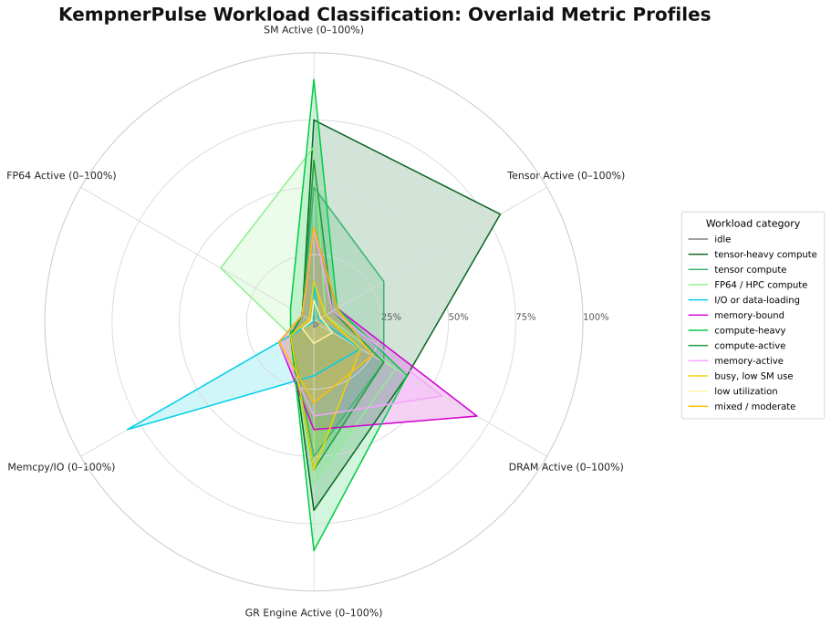
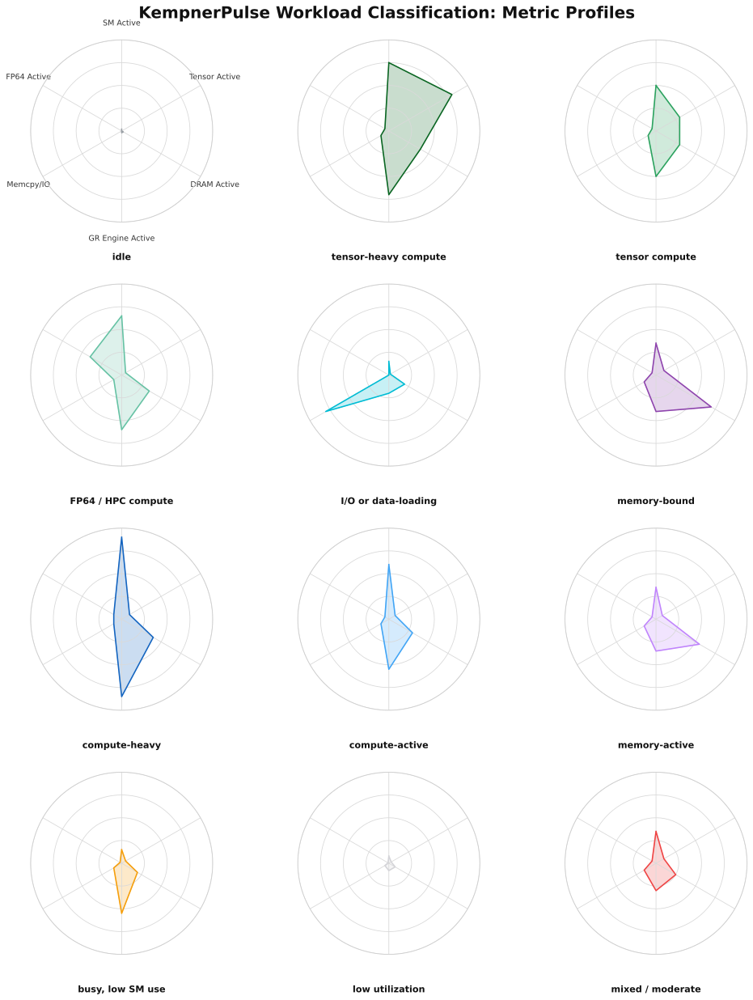

# Workload Classification & Health States

KempnerPulse classifies each GPU into one of **12 workload categories** and one
of **4 health states** every refresh cycle. The classification uses DCGM
profiling counters and follows thresholds recommended by
[NVIDIA's DCGM profiling metric guidance](https://docs.nvidia.com/datacenter/dcgm/latest/user-guide/feature-overview.html#profiling).

---

## Real Utilization

The dashboard computes a single **Real Utilization** score per GPU:

```
Real Util = clamp(0, 100,
              W_sm    × SM_ACTIVE
            + W_tensor × TENSOR_ACTIVE
            + W_dram   × DRAM_ACTIVE
            + W_gr     × GR_ENGINE_ACTIVE)
```

All four inputs are DCGM profiling-level hardware counters (0 to 1 range,
displayed as 0 to 100 %). The weights are configurable via `--weights` or the
convenience preset flags.

### Weight Presets

| Preset | Flag | W\_sm | W\_tensor | W\_dram | W\_gr | Best For |
|--------|------|-------|-----------|---------|-------|----------|
| AI/ML (default) | `--ai-weights` | 0.35 | 0.35 | 0.20 | 0.10 | Deep-learning training, LLM inference, transformers |
| HPC | `--hpc-weights` | 0.45 | 0.15 | 0.25 | 0.15 | Scientific computing, mixed CUDA, simulations |
| Memory-bound | `--mem-weights` | 0.35 | 0.10 | 0.40 | 0.15 | Bandwidth-heavy workloads, stencil codes |

Custom weights: `--weights W_SM,W_TENSOR,W_DRAM,W_GR` (auto-normalized to
sum to 1).

### What the Components Mean

| Component | Metric | Meaning |
|-----------|--------|---------|
| SM Active | `DCGM_FI_PROF_SM_ACTIVE` | Fraction of cycles with work assigned to streaming multiprocessors. Main compute signal. |
| Tensor Active | `DCGM_FI_PROF_PIPE_TENSOR_ACTIVE` | Fraction of cycles tensor cores are running. Critical for mixed-precision and AI workloads. |
| DRAM Active | `DCGM_FI_PROF_DRAM_ACTIVE` | Fraction of cycles HBM is moving data. Practical peak ~80 %. |
| GR Engine Active | `DCGM_FI_PROF_GR_ENGINE_ACTIVE` | Fraction of time the graphics/compute engine is active. Falls back to `GPU_UTIL` when unavailable. |

---

## NVIDIA Reference Points

The classification thresholds are derived from NVIDIA documentation:

| Metric | Threshold | NVIDIA Guidance |
|--------|-----------|-----------------|
| SM Active | ≥ 80 % | "Necessary, but not sufficient, for effective GPU use" |
| SM Active | < 50 % | "Likely indicates ineffective GPU usage" |
| DRAM Active | ≥ 50 % | Heavy memory traffic (practical peak ~80 %) |
| Tensor Active | ~93 % | Full saturation as measured by `dcgmproftester` |

---

## Workload Classification Table

Categories are evaluated **in order**; the first matching rule wins. This
means a GPU running tensor-heavy compute will not also be labeled
"compute-heavy", even if SM Active ≥ 80 %.

| # | Status | Bottleneck | Thresholds | Rationale |
|---|--------|------------|------------|-----------|
| 1 | **idle** | idle | Real Util < 5 %, GR < 5 %, DRAM < 5 %, no I/O | Nothing is running on the GPU. |
| 2 | **tensor-heavy compute** | compute | Tensor ≥ 50 % **and** SM ≥ 60 % | DL training or large-scale inference at peak tensor throughput. |
| 3 | **tensor compute** | compute | Tensor ≥ 15 % **and** SM ≥ 40 % | Meaningful tensor-core activity: mixed precision, moderate load. |
| 4 | **FP64 / HPC compute** | compute | FP64 ≥ 20 % **and** SM ≥ 50 % | Scientific double-precision workload. |
| 5 | **I/O or data-loading** | io | (Memcpy ≥ 40 % **or** PCIe RX/TX ≥ 1 GB/s) **and** SM < 30 % | Heavy host ↔ device transfer; SMs mostly idle. |
| 6 | **memory-bound** | memory | DRAM ≥ 50 % **and** SM < 50 % | Bandwidth limited. NVIDIA says SM < 50 % is likely ineffective. |
| 7 | **compute-heavy** | compute | SM ≥ 80 % | SMs well utilized. NVIDIA says ≥ 80 % is necessary for effective use. |
| 8 | **compute-active** | compute | SM ≥ 50 % | Moderate SM use, no tensor dominance. |
| 9 | **memory-active** | memory | DRAM ≥ 40 % | Significant DRAM traffic with some SM activity. |
| 10 | **busy, low SM use** | mixed | GR ≥ 40 % **and** SM < 25 % | Engine active but SMs underutilized. Likely overhead, sync, or small kernels. |
| 11 | **low utilization** | mixed | GR < 15 % **and** SM < 15 % **and** DRAM < 15 % | Barely any measurable activity. |
| 12 | **mixed / moderate** | mixed | *(fallthrough)* | No single dominant pattern. |

### Bottleneck Key

The bottleneck key is used for color-coding in the dashboard:

| Key | Color | Meaning |
|-----|-------|---------|
| `idle` | dim | GPU is not doing work. |
| `compute` | green | GPU is primarily compute-bound. |
| `io` | cyan | GPU is transfer/copy-bound. |
| `memory` | magenta | GPU is memory-bandwidth-bound. |
| `mixed` | yellow | No single dominant workload pattern. |

### Metric Profiles

Each workload category has a distinctive metric signature across the six axes:
SM Active, Tensor Active, DRAM Active, GR Engine Active, Memcpy/IO, and FP64 Active.

**Overlay** shows how all 12 categories compare on a single chart:



**Individual profiles** for each category:



---

## Health States

Health is evaluated independently from workload classification. It checks
error counters and temperatures against per-model thresholds.

### Health Status Levels

Conditions are evaluated **in order**; the first matching condition wins.

| Status | Style | Condition | Action |
|--------|-------|-----------|--------|
| **CRIT** | bold red | Row-remap failure > 0 **or** uncorrectable remapped rows > 0 | GPU has hardware memory errors. Remove from production immediately. |
| **WARN** | yellow | PCIe replay rate > 0/s | PCIe link quality issue; retransmissions occurring. Monitor closely. |
| **HOT** | yellow | GPU temp ≥ warning threshold **or** memory temp ≥ warning threshold | Thermal throttling zone. Check cooling and airflow. |
| **OK** | green | *(none of the above)* | Normal operating condition. |

### Temperature Thresholds by GPU Model

| GPU Model | Normal | Warning | Critical |
|-----------|--------|---------|----------|
| A100 | 85 °C | 93 °C | 95 °C |
| H100 | 85 °C | 95 °C | 105 °C |
| H200 | 80 °C | 95 °C | 105 °C |
| RTX 6000 | 85 °C | 92 °C | 105 °C |
| *Other / unknown* | *85 °C* | *93 °C* | *105 °C* |

### Health Metrics

| Check | DCGM Metric | Trigger | Health Status |
|-------|-------------|---------|---------------|
| ECC Row Remap Failure | `DCGM_FI_DEV_ROW_REMAP_FAILURE` | > 0 | CRIT |
| Uncorrectable Remapped Rows | `DCGM_FI_DEV_UNCORRECTABLE_REMAPPED_ROWS` | > 0 | CRIT |
| PCIe Replay Rate | `DCGM_FI_DEV_PCIE_REPLAY_COUNTER` (rate) | > 0/s | WARN |
| GPU Temperature | `DCGM_FI_DEV_GPU_TEMP` | ≥ model warning threshold | HOT |
| Memory Temperature | `DCGM_FI_DEV_MEMORY_TEMP` | ≥ model warning threshold | HOT |

---

## Further Reading

- [DCGM Field Identifiers](https://docs.nvidia.com/datacenter/dcgm/latest/dcgm-api/dcgm-api-field-ids.html)
- [DCGM Profiling Metrics Guide](https://docs.nvidia.com/datacenter/dcgm/latest/user-guide/feature-overview.html#profiling)
- [dcgm-exporter GPU metrics](https://github.com/NVIDIA/dcgm-exporter)
